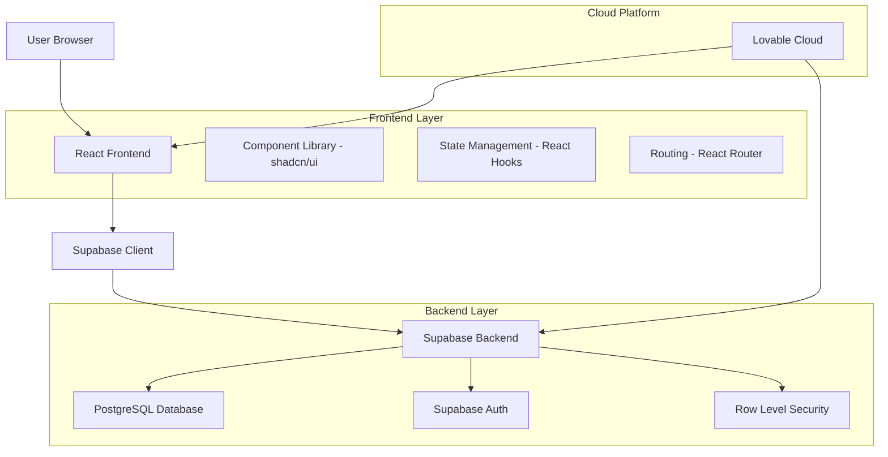
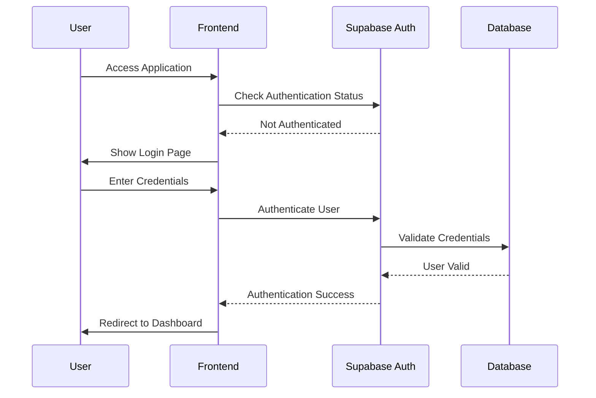
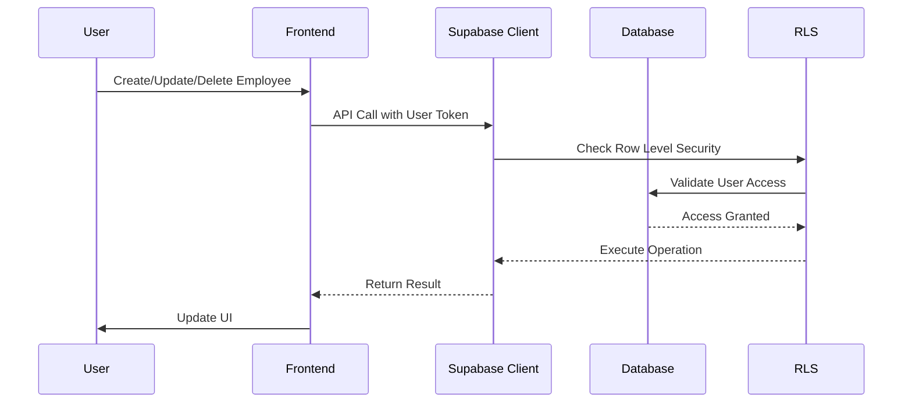

# Employee Data Management System - Comprehensive Documentation

## Table of Contents
1. [Project Overview](#project-overview)
2. [Project Workflow & Architecture](#project-workflow--architecture)
3. [Features & Functionality](#features--functionality)
4. [Technology Stack](#technology-stack)
5. [Setup & Installation](#setup--installation)
6. [Cloud Database & Lovable Frontend Rationale](#cloud-database--lovable-frontend-rationale)
7. [API Documentation](#api-documentation)
8. [Database Schema](#database-schema)
9. [Security Implementation](#security-implementation)
10. [Deployment Guide](#deployment-guide)

---

## Project Overview

### What is Employee Data Management System?

The Employee Data Management System is a modern, full-stack web application designed to streamline employee data management for organizations of all sizes. It provides a comprehensive solution for managing employee information with an intuitive interface, real-time analytics, and secure data handling.

### Key Objectives

- **Simplify HR Operations**: Reduce manual paperwork and streamline employee data management
- **Ensure Data Security**: Implement robust authentication and data isolation
- **Provide Insights**: Offer visual analytics to help organizations understand their workforce
- **Scale Efficiently**: Built on cloud infrastructure for reliability and scalability

### Target Audience

- **HR Departments**: Manage employee records efficiently
- **Small to Medium Businesses**: Affordable solution for employee management
- **Startups**: Quick setup with minimal infrastructure requirements
- **Remote Teams**: Cloud-based access from anywhere

---

## Project Workflow & Architecture

### High-Level Architecture



### Application Flow

#### 1. Authentication Flow


#### 2. CRUD Operations Flow


### Component Architecture

```
src/
├── pages/                    # Route Components
│   ├── Dashboard.tsx        # Main application container
│   ├── Auth.tsx            # Authentication pages
│   └── Index.tsx           # Route configuration
├── components/              # Reusable Components
│   ├── ui/                 # shadcn/ui components
│   ├── EmployeeList.tsx    # Data table component
│   ├── EmployeeDialog.tsx  # Form modal component
│   └── EmployeeAnalytics.tsx # Charts component
├── integrations/           # External Services
│   └── supabase/          # Database client
├── hooks/                 # Custom React Hooks
└── lib/                   # Utility Functions
```

---

## Features & Functionality

### Core Features

#### 1. Employee Management
- **Create**: Add new employees with comprehensive form validation
- **Read**: View all employees in a responsive, sortable table
- **Update**: Edit employee information with inline editing or modal forms
- **Delete**: Remove employees with confirmation dialogs

#### 2. Search & Filter
- **Real-time Search**: Instant filtering by employee name
- **Case-insensitive**: Search works regardless of case
- **Live Results**: Dynamic result count display

#### 3. Authentication System
- **User Registration**: Secure account creation
- **User Login**: Email/password authentication
- **Session Management**: Automatic session handling
- **Protected Routes**: Secure access to employee data

#### 4. Visual Analytics Dashboard
- **Department Distribution**: Pie chart showing employee distribution
- **Position Analysis**: Bar chart of roles across organization
- **Hiring Trends**: Line chart tracking recruitment over time
- **Salary Insights**: Average salary analysis by department
- **Key Metrics**: Dashboard cards with summary statistics

### Advanced Features

#### 1. Responsive Design
- **Mobile-First**: Optimized for all screen sizes
- **Touch-Friendly**: Large buttons and intuitive interactions
- **Adaptive Layout**: Tables convert to cards on mobile devices

#### 2. Data Validation
- **Client-Side Validation**: Real-time form validation
- **Required Fields**: Name and email validation
- **Email Format**: Proper email format checking
- **Error Handling**: User-friendly error messages

#### 3. User Experience
- **Loading States**: Visual feedback during operations
- **Toast Notifications**: Success and error messages
- **Smooth Animations**: Enhanced user interactions
- **Intuitive Navigation**: Clear navigation between sections

---

## Technology Stack

### Frontend Technologies

#### React 18
- **Why React**: Component-based architecture for maintainable code
- **Benefits**: Virtual DOM for performance, large ecosystem, strong community
- **Usage**: Core framework for building user interface

#### TypeScript
- **Why TypeScript**: Type safety, better IDE support, reduced runtime errors
- **Benefits**: Compile-time error detection, enhanced developer experience
- **Usage**: All components and utilities are fully typed

#### Tailwind CSS
- **Why Tailwind**: Utility-first CSS framework for rapid development
- **Benefits**: Consistent design system, responsive utilities, small bundle size
- **Usage**: Styling all components with utility classes

#### shadcn/ui
- **Why shadcn/ui**: High-quality, accessible component library
- **Benefits**: Built on Radix UI, customizable, TypeScript support
- **Usage**: Pre-built components for forms, tables, dialogs, charts

#### React Router DOM
- **Why React Router**: Declarative routing for single-page applications
- **Benefits**: Client-side routing, nested routes, programmatic navigation
- **Usage**: Navigation between authentication and dashboard pages

### Backend Technologies

#### Supabase
- **Why Supabase**: Open-source Firebase alternative with PostgreSQL
- **Benefits**: Real-time subscriptions, built-in auth, automatic APIs
- **Usage**: Database, authentication, and API layer

#### PostgreSQL
- **Why PostgreSQL**: Robust relational database with advanced features
- **Benefits**: ACID compliance, JSON support, excellent performance
- **Usage**: Primary data storage with complex queries and relationships

#### Row-Level Security (RLS)
- **Why RLS**: Database-level security for multi-tenant applications
- **Benefits**: Automatic data isolation, secure by default
- **Usage**: Ensuring users only access their own employee data

### Development Tools

#### Vite
- **Why Vite**: Fast build tool with hot module replacement
- **Benefits**: Lightning-fast development server, optimized builds
- **Usage**: Development server and production builds

#### ESLint
- **Why ESLint**: Code quality and consistency enforcement
- **Benefits**: Catches errors early, enforces coding standards
- **Usage**: Code linting and formatting rules

### Cloud Platform

#### Lovable Cloud
- **Why Lovable**: Integrated development and deployment platform
- **Benefits**: Automatic Supabase setup, instant deployments, zero configuration
- **Usage**: Development environment and deployment platform

---

## Setup & Installation

### Prerequisites

Before setting up the project, ensure you have:

- **Node.js 18+**: [Download from nodejs.org](https://nodejs.org/)
- **npm or yarn**: Package manager (comes with Node.js)
- **Git**: Version control system
- **Modern Browser**: Chrome, Firefox, Safari, or Edge

### Installation Steps

#### 1. Clone the Repository
```bash
git clone <your-repository-url>
cd empflow-dash
```

#### 2. Install Dependencies
```bash
npm install
# or
yarn install
```

#### 3. Environment Configuration

The project uses Lovable Cloud which automatically configures environment variables:

```env
VITE_SUPABASE_URL=your_supabase_url
VITE_SUPABASE_PUBLISHABLE_KEY=your_supabase_anon_key
VITE_SUPABASE_PROJECT_ID=your_project_id
```

**Note**: No manual environment setup is required with Lovable Cloud!

#### 4. Start Development Server
```bash
npm run dev
# or
yarn dev
```

The application will be available at `http://localhost:5173`

#### 5. Build for Production
```bash
npm run build
# or
yarn build
```

### Development Workflow

#### 1. Code Structure
- **Components**: Place reusable components in `src/components/`
- **Pages**: Route components go in `src/pages/`
- **Utilities**: Helper functions in `src/lib/`
- **Hooks**: Custom hooks in `src/hooks/`

#### 2. Styling Guidelines
- Use Tailwind utility classes for styling
- Follow the existing design system
- Ensure responsive design for all components

#### 3. TypeScript Guidelines
- Define interfaces for all data structures
- Use proper typing for function parameters and return values
- Leverage TypeScript's strict mode benefits

---

## Cloud Database & Lovable Frontend Rationale

### Why Cloud Database (Supabase)?

#### 1. **Scalability & Performance**
- **Automatic Scaling**: Supabase handles traffic spikes automatically
- **Global CDN**: Fast data access from anywhere in the world
- **Connection Pooling**: Efficient database connection management
- **Real-time Capabilities**: Live updates without complex WebSocket setup

#### 2. **Developer Experience**
- **Zero Configuration**: No database setup or maintenance required
- **Auto-generated APIs**: REST and GraphQL APIs created automatically
- **Built-in Authentication**: Complete auth system with multiple providers
- **Dashboard Interface**: Easy database management through web UI

#### 3. **Security & Compliance**
- **Row-Level Security**: Database-level access control
- **SSL Encryption**: All connections encrypted by default
- **Backup & Recovery**: Automatic backups with point-in-time recovery
- **SOC 2 Compliance**: Enterprise-grade security standards

#### 4. **Cost Effectiveness**
- **Pay-as-you-scale**: Only pay for what you use
- **No Infrastructure Costs**: No servers to maintain or manage
- **Free Tier**: Generous free tier for development and small projects
- **Predictable Pricing**: Transparent pricing model

#### 5. **Modern Features**
- **Real-time Subscriptions**: Live data updates
- **Edge Functions**: Serverless functions at the edge
- **Storage**: File storage with CDN
- **Vector Search**: AI-ready database features

### Why Lovable Frontend?

#### 1. **Rapid Development**
- **AI-Powered**: Natural language to code conversion
- **Component Library**: Pre-built, customizable components
- **Best Practices**: Built-in patterns for modern React development
- **Type Safety**: Full TypeScript support out of the box

#### 2. **Integrated Ecosystem**
- **Supabase Integration**: Seamless connection to Supabase backend
- **Deployment**: One-click deployment to global CDN
- **Environment Management**: Automatic environment variable handling
- **Version Control**: Git integration for code management

#### 3. **Production Ready**
- **Performance Optimized**: Built-in optimizations for production
- **SEO Friendly**: Server-side rendering capabilities
- **Accessibility**: WCAG compliant components
- **Mobile Responsive**: Mobile-first design approach

#### 4. **Maintenance & Updates**
- **Automatic Updates**: Framework and dependency updates
- **Security Patches**: Regular security updates
- **Monitoring**: Built-in performance monitoring
- **Analytics**: Usage analytics and insights

#### 5. **Developer Tools**
- **Hot Reload**: Instant code changes in development
- **Error Boundaries**: Graceful error handling
- **Debugging**: Advanced debugging tools
- **Testing**: Built-in testing framework

### Comparison with Alternatives

#### Traditional Setup vs. Cloud Approach

| Aspect | Traditional Setup | Cloud Approach (Lovable + Supabase) |
|--------|------------------|-------------------------------------|
| **Setup Time** | Days to weeks | Minutes |
| **Infrastructure** | Manual server management | Fully managed |
| **Scaling** | Manual intervention required | Automatic |
| **Security** | Manual configuration | Built-in best practices |
| **Updates** | Manual maintenance | Automatic updates |
| **Cost** | High upfront + ongoing | Pay-as-you-use |
| **Expertise Required** | DevOps + Backend + Frontend | Frontend focus |

#### Database Alternatives

| Feature | SQLite | PostgreSQL (Supabase) |
|---------|--------|----------------------|
| **Concurrent Users** | Limited | Unlimited |
| **Data Types** | Basic | Advanced (JSON, Arrays, etc.) |
| **Security** | File-based | Row-level security |
| **Backup** | Manual | Automatic |
| **Real-time** | Not available | Built-in |
| **Scalability** | Single machine | Cloud-scale |

---

## API Documentation

### Authentication Endpoints

#### Register User
```typescript
POST /auth/v1/signup
{
  "email": "user@example.com",
  "password": "securepassword"
}
```

#### Login User
```typescript
POST /auth/v1/token
{
  "email": "user@example.com",
  "password": "securepassword"
}
```

### Employee Management Endpoints

#### Get All Employees
```typescript
GET /rest/v1/employees
Headers: {
  "Authorization": "Bearer <token>",
  "apikey": "<supabase_anon_key>"
}
```

#### Create Employee
```typescript
POST /rest/v1/employees
Headers: {
  "Authorization": "Bearer <token>",
  "apikey": "<supabase_anon_key>",
  "Content-Type": "application/json"
}
Body: {
  "name": "John Doe",
  "email": "john@example.com",
  "phone": "+1234567890",
  "department": "Engineering",
  "position": "Developer",
  "salary": 75000,
  "hire_date": "2024-01-15"
}
```

#### Update Employee
```typescript
PATCH /rest/v1/employees?id=eq.<employee_id>
Headers: {
  "Authorization": "Bearer <token>",
  "apikey": "<supabase_anon_key>",
  "Content-Type": "application/json"
}
Body: {
  "name": "John Smith",
  "salary": 80000
}
```

#### Delete Employee
```typescript
DELETE /rest/v1/employees?id=eq.<employee_id>
Headers: {
  "Authorization": "Bearer <token>",
  "apikey": "<supabase_anon_key>"
}
```

---

## Database Schema

### Tables

#### employees
```sql
CREATE TABLE public.employees (
  id UUID NOT NULL DEFAULT gen_random_uuid() PRIMARY KEY,
  user_id UUID NOT NULL REFERENCES auth.users(id) ON DELETE CASCADE,
  name TEXT NOT NULL,
  email TEXT NOT NULL,
  phone TEXT,
  department TEXT,
  position TEXT,
  salary NUMERIC,
  hire_date DATE,
  created_at TIMESTAMP WITH TIME ZONE NOT NULL DEFAULT now(),
  updated_at TIMESTAMP WITH TIME ZONE NOT NULL DEFAULT now()
);
```

### Row-Level Security Policies

```sql
-- Enable RLS
ALTER TABLE public.employees ENABLE ROW LEVEL SECURITY;

-- Users can view their own employees
CREATE POLICY "Users can view their own employees"
ON public.employees FOR SELECT
USING (auth.uid() = user_id);

-- Users can create their own employees
CREATE POLICY "Users can create their own employees"
ON public.employees FOR INSERT
WITH CHECK (auth.uid() = user_id);

-- Users can update their own employees
CREATE POLICY "Users can update their own employees"
ON public.employees FOR UPDATE
USING (auth.uid() = user_id);

-- Users can delete their own employees
CREATE POLICY "Users can delete their own employees"
ON public.employees FOR DELETE
USING (auth.uid() = user_id);
```

### Functions

#### Update Timestamp Function
```sql
CREATE OR REPLACE FUNCTION public.update_updated_at_column()
RETURNS TRIGGER AS $$
BEGIN
  NEW.updated_at = now();
  RETURN NEW;
END;
$$ LANGUAGE plpgsql SET search_path = public;
```

#### Update Timestamp Trigger
```sql
CREATE TRIGGER update_employees_updated_at
BEFORE UPDATE ON public.employees
FOR EACH ROW
EXECUTE FUNCTION public.update_updated_at_column();
```

---

## Security Implementation

### Authentication Security

#### 1. **JWT Tokens**
- Secure token-based authentication
- Automatic token refresh
- Token expiration handling

#### 2. **Password Security**
- Bcrypt hashing for password storage
- Minimum password requirements
- Secure password reset flow

#### 3. **Session Management**
- Secure session storage
- Automatic session cleanup
- Cross-site request forgery protection

### Data Security

#### 1. **Row-Level Security (RLS)**
```sql
-- Users can only access their own data
CREATE POLICY "User data isolation"
ON public.employees
FOR ALL
USING (auth.uid() = user_id);
```

#### 2. **Input Validation**
- Client-side validation for user experience
- Server-side validation for security
- SQL injection prevention

#### 3. **HTTPS Encryption**
- All communications encrypted
- Secure cookie settings
- HSTS headers

### API Security

#### 1. **Rate Limiting**
- API rate limiting to prevent abuse
- User-specific rate limits
- IP-based restrictions

#### 2. **CORS Configuration**
- Proper CORS headers
- Origin validation
- Credential handling

#### 3. **Error Handling**
- Secure error messages
- No sensitive data exposure
- Proper logging

---

## Deployment Guide

### Lovable Cloud Deployment

#### 1. **Automatic Deployment**
- Push code to repository
- Lovable automatically builds and deploys
- Global CDN distribution
- SSL certificate management

#### 2. **Environment Management**
- Automatic environment variable injection
- Production and staging environments
- Database connection management

#### 3. **Monitoring**
- Built-in performance monitoring
- Error tracking and logging
- Usage analytics

### Manual Deployment

#### 1. **Build Application**
```bash
npm run build
```

#### 2. **Deploy to Vercel**
```bash
npm install -g vercel
vercel --prod
```

#### 3. **Deploy to Netlify**
```bash
npm install -g netlify-cli
netlify deploy --prod --dir=dist
```

### Database Migration

#### 1. **Local Development**
```bash
npx supabase start
npx supabase db reset
```

#### 2. **Production Migration**
```bash
npx supabase db push
```

### Environment Variables

#### Production Environment
```env
VITE_SUPABASE_URL=https://your-project.supabase.co
VITE_SUPABASE_PUBLISHABLE_KEY=your-production-key
VITE_SUPABASE_PROJECT_ID=your-project-id
```

---

## Conclusion

The Employee Data Management System represents a modern approach to HR software development, leveraging cloud-native technologies to deliver a scalable, secure, and user-friendly solution. By combining the power of Supabase's backend infrastructure with Lovable's frontend development platform, this project demonstrates how modern web applications can be built efficiently while maintaining high standards of security, performance, and user experience.

The choice of cloud database and Lovable frontend provides numerous advantages including reduced development time, automatic scaling, built-in security features, and simplified deployment processes. This architecture allows developers to focus on building features rather than managing infrastructure, resulting in faster time-to-market and lower operational costs.

---

*This documentation is maintained alongside the codebase and should be updated as the project evolves.*
